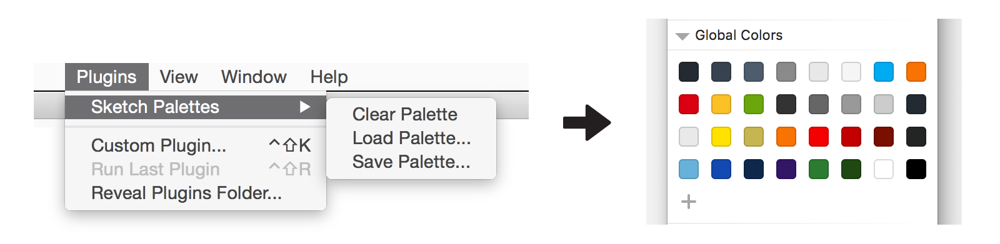

# Hudl Sketch Color Palette

A Hudl Sketch Color Palette using [Sketch Palettes Plugin](https://github.com/andrewfiorillo/sketch-palettes)

## Installation

1. Download & Install the [Sketch Palettes Plugin](https://github.com/andrewfiorillo/sketch-palettes)
2. Download [hudl.sketchpalette](https://github.com/brody/hudl_colorswatches/archive/master.zip)
3. (Optional) Clear Global (or Document) palette
4. In Sketch, go to Plugins > Sketch Palettes > Global (or Document) Colors > Load Palette
5. Locate & Select "hudl.sketchpalette"